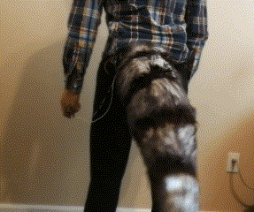
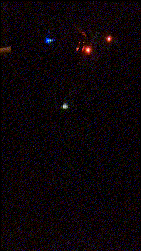
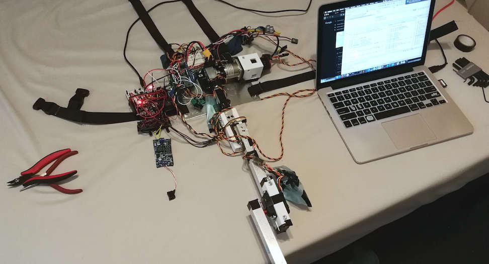

# 3DOF acrobatic tail

This repository contains firmware, simulations and design files for a 3DOF tail. The firmware powers an F103 chip in [a Blackpill ST-Mini board](https://robotdyn.com/stm32f103-stm32-arm-mini-system-dev-board-stm-firmware.html) and an STM32G431 in [a G431B-ESC dev board](https://www.digikey.com/en/product-highlight/s/stmicroelectronics/b-g431b-esc1-discovery-kit-with-stm32g431cb-mcu) by ST. The firmware in `stm/` also includes projects on F303 and F072 chips used during testing.

Control, build and electrical details for this prototype are described and updated in [a series of posts on lam.io](//lam.io/projects/tail/control/).

Several simulations in Python and C are included as part of process tracking, including:

- Inverse kinematics tests in [`ctrl/`](ctrl/)
- A visual browser-based kinematic simulator in JS under [`kin-sim/`](kin-sim/)
- A Newton's method solver for path timing in [`mech/newton.py`](mech/newton.py)
- Motor selection among Quicrun 3650 models in [`quicrun_ops.py`](quicrun_ops.py)
- Interpolation spline design in [`spline_stable.py`](spline_stable.py)

The tail is controlled by a 3-axis handheld input, which is converted to joint angles through an exact lookup table generated by [OpenRAVE's IKFast](http://openrave.org/docs/0.8.0/openravepy/ikfast/).

> (2020-07-11) At the moment. the code is mostly for looking at &mdash; it is extremely specific to my own build. In the coming weeks expect the code to be generalized and a workflow presented to be at least grabbable in chunks.